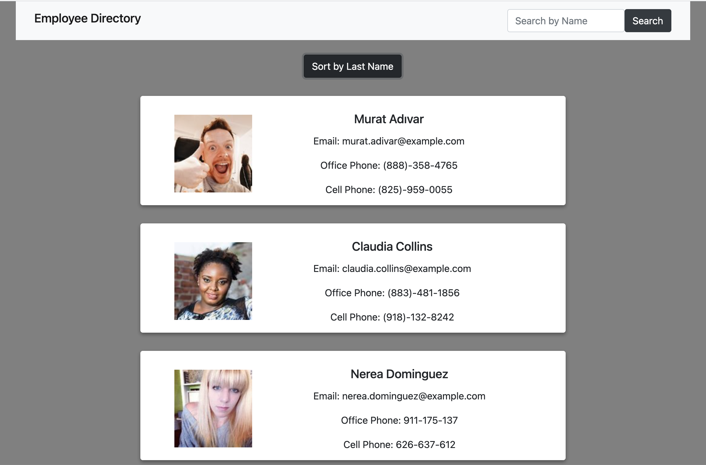

# Employee Directory

### Languages and Tools Used:

 
 

 

 
 

 

---
  ## Description
   Employee Directory is an app I created with React. This website is designed for employees in businesses to view non-sensitive data about their co-workers. It's an easy-to-navigate directory, where a user has options to search by name or sort in alphabetical order. This project was a homework assignment in UC Davis Coding Bootcamp, where I am able to showcase my ability to work with React. 
## Table of Contents 
  * [Installation](#installation)
  * [Usage](#usage)
  * [Questions](#questions)
  ## Installation 
  Access website at: https://spclk.github.io/Employee-Directory/
  ## Usage 
  This app  
  ## Questions? 
  Contact me by email listed on https://github.com/spclk

